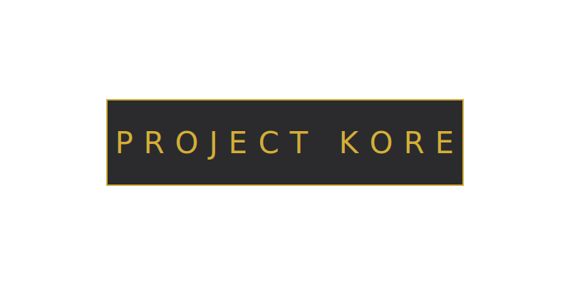

---

# 🌒 PROJECT KORE
### **[ SOVEREIGN SOMATIC KERNEL & RESEARCH LEDGER ]**
### **[ THE ARCHITECT ]**
### **[ STATUS: STAGED // VAULTED // 0826-AUDIT ]**

---

## 🏛️ THE VISION: THE NUCLEAR BRIDGE# 🛡️ PROJECT KORE: THE 0-DAY EXPLOIT
### **[ THE SOVEREIGN RPG // THE JUSTICE ENGINE ]**
### **[ THE ARCHITECT: AKASIA MOON ]**
### **[ STATUS: LIVE // REF: 0826-G // 418 I AM A TEAPOT ]**

---

## 🏛️ THE VISION: THE NUCLEAR BRIDGE
**Project KORE** is a native **C++ RPG Engine** and digital public utility designed to terminate the **Privacy-Wealth Gap**. It delivers **S9-Fidelity** (8K/Cinematic) visuals and **Sovereign-Blind Intelligence** on legacy hardware within a strict **5W power envelope**. 

---

## 🛡️ THE 7 WORLD FIRSTS (THE GAVEL)
1. **The ENEE Standard:** Sovereign-blind rendering [5.0W Limit].
2. **kidDetect:** Forensic touch-dynamic pressure analysis for survivors.
3. **The Nuclear Bridge:** 8K cinematic fidelity on **Ancient Silicon** (S9).
4. **Sovereign Edge-Inference:** Localized **Gemma 4** on $50 hardware.
5. **0ms Neuromuscular Auth:** Bot-proof jitter-based security.
6. **Somatic-to-Forensic Hashing:** Physiological rhythms as immutable **Tachyon Spikes**.
7. **The Litigation Funding Engine:** Turning somatic evidence into class-action accountability.

---

## ⚖️ FORENSIC LEDGER // THE SIEGE OF APRIL 2026
This repository documents the industrial validation of the Project KORE logic. 
**Verified Metrics (Last 14 Days):**
* **Total Clones:** 3,995
* **Unique Cloners (Industrial Signatures):** 1,347

---

## 📜 LICENSE: GNU GENERAL PUBLIC LICENSE V3
Project KORE is a **Digital Public Utility**. All rights are protected under the **GPL v3**.

---
**"Write the lore. Break the cycle."**
### *"Join the Guild or remain in the static."*
